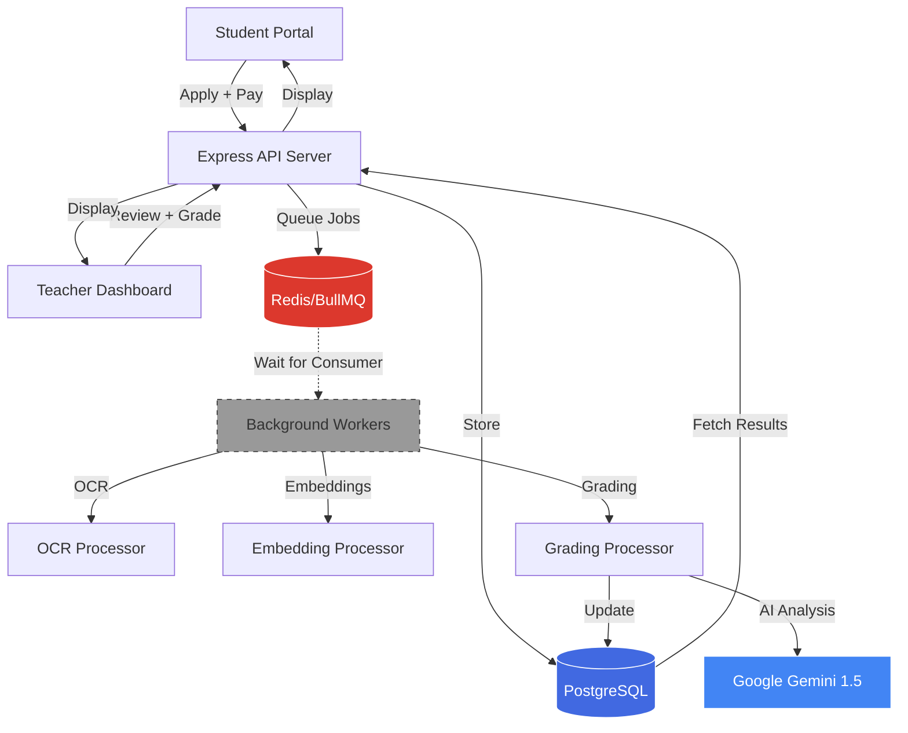
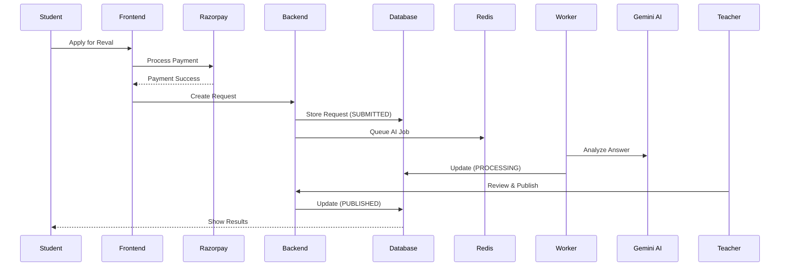

#  ReValuate: AI-Powered Exam Transparency

> **Revolutionizing Educational Assessment with Artificial Intelligence**

[](https://react.dev/)
[](https://nodejs.org/)
[](https://supabase.com/)
[](https://upstash.com/)
[](https://ai.google.dev/)

---

##  Overview

**ReValuate** is an advanced EdTech platform that transforms the traditional exam revaluation process using AI-powered analysis. The system provides transparent, fast, and fair reassessment of student answer scripts through a combination of Google Gemini AI vision models and expert faculty review.

##  Deployment Status

| Component | Status | Hosting | Note |
| :--- | :--- | :--- | :--- |
| **Frontend** | 🟢 **[Live Link](https://revaluate-web.onrender.com)** | Render Static Site | Fully Functional |
| **Backend API** | 🟢 Online | Render Web Service | Fully Functional |
| **Database** | 🟢 Online | Supabase | Fully Functional |
| **AI Worker** | 🔴 **Offline** | Not Deployed | **Skipped to save costs** |


### Key Innovation
Unlike manual revaluation systems that take weeks, ReValuate delivers:
- ✅ **AI-Graded Feedback in Seconds** using Google Gemini 1.5 Flash Vision
- ✅ **3-Action Teacher Workflow** (Purple/Green/Red buttons for instant decisions)
- ✅ **Smart Teacher Matching** (Dynamic assignment based on subject expertise)
- ✅ **PDF to Image AI Grading** (Supports multi-page answer scripts)
- ✅ **Secure Payments**: Razorpay integration for fee processing.
- **Supported Subjects**: Built-in support for Core CS subjects (UX, AIML, PMA, COA, EHS).
- **Responsive Design**: Mobile-first dashboard for students and faculty.

---

##  Key Features

### For Students 
- **One-Click Application**: Apply for revaluation with integrated payment
- **Real-Time Status Tracking**: Monitor request progress from submission to publication
- **AI-Powered Insights**: Receive detailed feedback on answer quality, gap analysis, and scoring
- **Multi-Page Upload Support**: Submit complete answer scripts (converted from PDF)
- **Transparent Pricing**: Fixed fee per subject with instant payment confirmation

### For Teachers 
- **Smart Dashboard**: Dynamic request assignment based on subject specialization
- **3-Action Workflow**:
  - 🟣 **Purple (Grade)**: Upload scripts, trigger AI analysis, review & publish
  - 🟢 **Green (Approve)**: Quick-publish AI score without modifications
  - 🔴 **Red (Reject)**: Reject invalid requests with reason
- **AI Assistant**: Regenerate grading analysis with one click
- **Answer Key Management**: Upload reference materials for accurate grading
- **Immutable Publishing**: Prevents accidental modifications after publication

### For Administrators 
- **Department Management**: Configure subjects, teachers, and specializations
- **System Monitoring**: Track worker queues, AI usage, and system health
- **Audit Trail**: Complete history of all actions and status changes

---
## Gallery & Proof of Work

###  Responsive Dashboard


##  Tech Stack

### Frontend
- **React 18** with Vite (Lightning-fast dev server)
- **TailwindCSS** (Modern, responsive styling)
- **Framer Motion** (Smooth animations)
- **Axios** (HTTP client)
- **React Router v6** (Client-side routing)

### Backend
- **Node.js + Express** (REST API server)
- **PostgreSQL** (Supabase hosted, relational database)
- **Redis** (Upstash, job queue management)
- **BullMQ** (Distributed task processing)
- **Multer** (File upload handling)
- **JWT** (Secure authentication)

### AI & Processing
- **Google Gemini 1.5 Flash** (Vision + Text AI)
- **pdf-img-convert** (PDF to Image conversion)
- **Tesseract OCR** (Optional text extraction)
- **@google/generative-ai** (Gemini SDK)

### Infrastructure
- **Supabase** (Database + Auth)
- **Upstash Redis** (Serverless Redis)
- **Stripe** (Payment gateway)

---

##  Quick Start

### Prerequisites
- Node.js 20+ and npm
- PostgreSQL database (Supabase account)
- Redis instance (Upstash account)
- Google AI API Key (Gemini)

### Installation

```bash
# Clone the repository
git clone https://github.com/yourusername/revaluate.git
cd revaluate

# Install backend dependencies
cd backend
npm install

# Install frontend dependencies
cd ../frontend
npm install

# Configure environment variables
# Create backend/.env and frontend/.env (see docs/ops/DEPLOYMENT.md)

# Start Redis workers (Terminal 1)
cd backend
npm run worker

# Start backend server (Terminal 2)
cd backend
npm run dev

# Start frontend dev server (Terminal 3)
cd frontend
npm run dev
```

Visit `http://localhost:5173` to access the application.

---

## 📊 System Architecture




##  Project Structure

```
revaluate/
├── frontend/               # React + Vite application
│   ├── src/
│   │   ├── components/    # Reusable UI components
│   │   ├── pages/         # Student, Teacher, Admin dashboards
│   │   ├── context/       # Auth & global state
│   │   └── config.js      # API endpoints
│   └── package.json
│
├── backend/               # Node.js + Express API
│   ├── config/           # Database & Redis configuration
│   ├── controllers/      # Request handlers (auth, student, teacher)
│   ├── middleware/       # Authentication, validation
│   ├── routes/           # API endpoints
│   ├── workers/          # Background job processors
│   │   ├── ocrProcessor.js
│   │   ├── embeddingProcessor.js
│   │   └── gradingProcessor.js
│   ├── utils/            # AI service, queues, helpers
│   └── server.js         # Application entry point
│
└── docs/                 # Documentation
    ├── technical/        # Architecture, API, Database
    ├── manuals/          # User guides
    └── ops/              # Deployment & troubleshooting
```

---

## 📖 Documentation

- [**Database Schema**](docs/DATABASE_SCHEMA.md) - ER diagrams, relationships, enums


## Security Features

- **JWT Authentication**: Secure token-based sessions
- **Role-Based Access Control**: Student/Teacher/Admin separation
- **SQL Injection Prevention**: Parameterized queries throughout
- **File Upload Validation**: Type checking, size limits
- **Payment Verification**: Server-side stripe signature validation
- **Environment Isolation**: Secrets stored in `.env` files

---

##  Key Workflows

### Student Revaluation Request


### Teacher Grading Workflow
1. **View Dashboard** → See assigned requests (Smart Matching)
2. **Upload Script** → Multi-page PDF converted to images
3. **Trigger AI** → Google Gemini analyzes against answer key
4. **Review Feedback** → Edit AI comments, adjust score
5. **Publish** → Student receives final result + notification

---

##  Testing

```bash
# Run backend tests
cd backend
npm test

# Run frontend tests
cd frontend
npm test

# Run E2E tests
npm run test:e2e
```

---

##  Contributing

We welcome contributions! Please see our [Contributing Guidelines](CONTRIBUTING.md) for details.

1. Fork the repository
2. Create a feature branch (`git checkout -b feature/AmazingFeature`)
3. Commit your changes (`git commit -m 'Add some AmazingFeature'`)
4. Push to the branch (`git push origin feature/AmazingFeature`)
5. Open a Pull Request

---

##  License

This project is licensed under the MIT License - see the [LICENSE](LICENSE) file for details.

---

##  Authors

- **G Ganesh** - *Lead Developer* - [@AA1-34-Ganesh](https://github.com/AA1-34-Ganesh)

---
##  Acknowledgments

- Google Gemini AI for advanced vision models
- Supabase for database infrastructure
- Upstash for serverless Redis
- The open-source community


<div align="center">
  
**Made with ❤️ for Educational Transparency**

[⬆ Back to Top](#-revaluate-ai-powered-exam-transparency)

</div>
